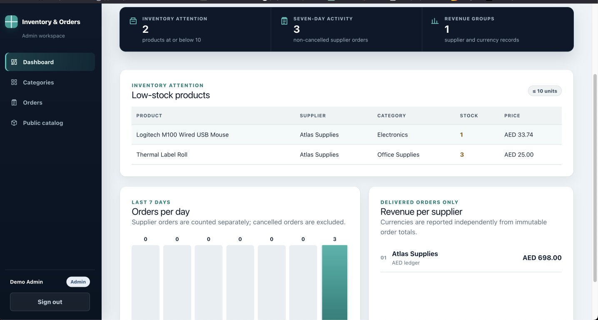
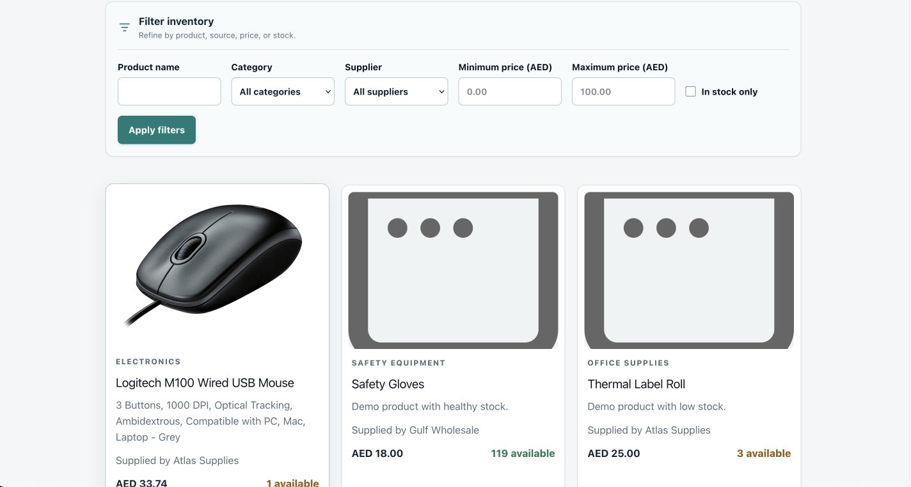
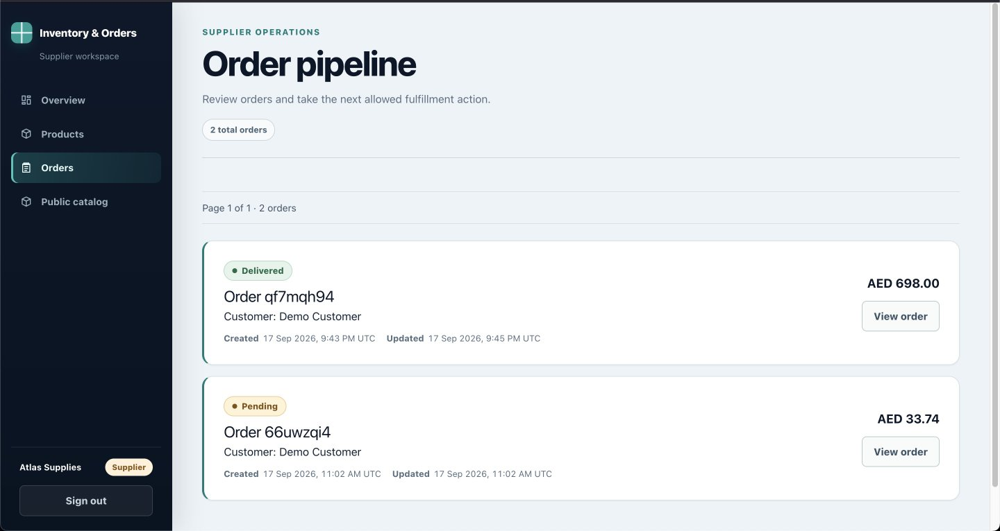
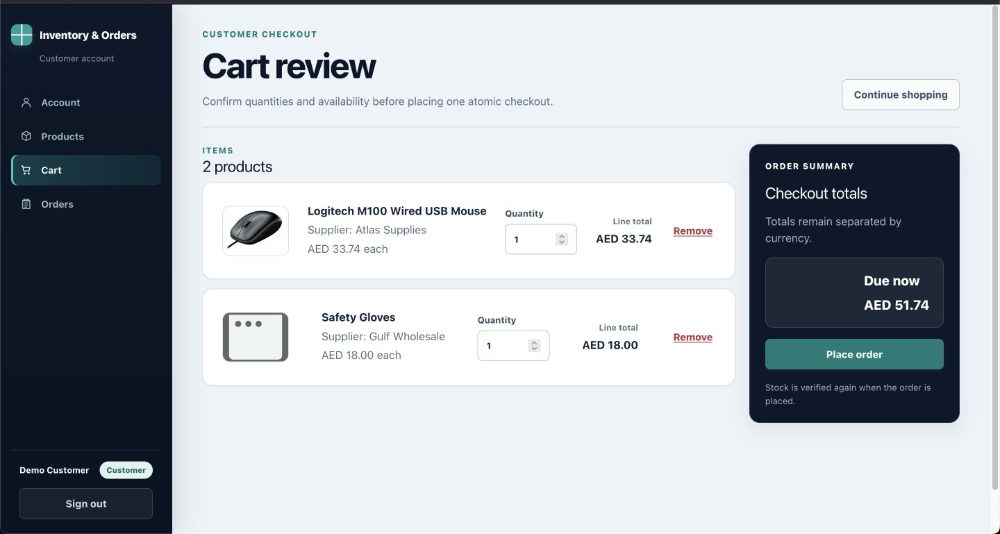
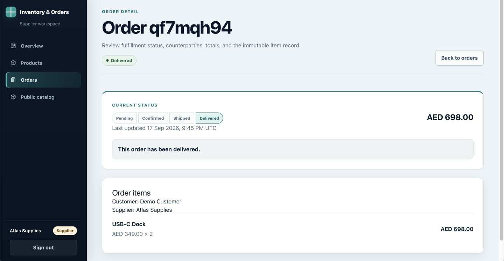

# Inventory & Order Management System

Role-based inventory and order management modular monolith with database-backed authentication, catalog management,
transactional customer checkout, and an authorized order-status workflow.

## Live deployment

- Application: [https://inventory-order-mohamad.vercel.app](https://inventory-order-mohamad.vercel.app)
- Source: [https://github.com/MoSallah21/inventory-order](https://github.com/MoSallah21/inventory-order)

### Demo accounts

All demo accounts use the password `DemoPass!2026`.

- Admin: `admin@example.test`
- Supplier: `supplier1@example.test`
- Customer: `customer@example.test`

## Application preview

### Admin operations dashboard

The Admin workspace provides low-stock visibility, seven-day order activity, supplier revenue grouped by currency, and direct access to operational management.



### Public product catalog

The public catalog supports product search, category and supplier filtering, price ranges, stock availability, and responsive pagination.



### Supplier inventory workspace

Suppliers manage their authorized product inventory, stock levels, pricing, lifecycle state, and product details from a dedicated workspace.



### Customer cart and checkout

Customers can review product quantities, supplier details, line totals, currency-separated totals, stock warnings, and checkout actions.



### Order workflow

Role-authorized order details expose status progression, counterparties, immutable totals, item snapshots, cancellation rules, and terminal-state explanations.



## Status

Implemented:

- Next.js 16 App Router, strict TypeScript, Tailwind CSS, ESLint, and Prettier.
- PostgreSQL schema and initial Prisma migration.
- Better Auth email/password credentials with database-backed sessions.
- Server-side actor, disabled-account, and role checks.
- Role-aware authenticated navigation and protected `/admin`, `/supplier`, and `/account` homes.
- Better Auth server-session sign-out with safe sign-in and protected-page redirects.
- Deterministic demo users, categories, and products.
- Admin dashboard at `/admin` with low-stock, daily-order, and supplier-revenue views.
- Admin category management at `/admin/categories`.
- Supplier product management at `/supplier/products`.
- Server-rendered public catalog at `/products`.
- Public product search/filtering, fixed-size product and role-scoped order pagination, and authorized admin order CSV export.
- Unit and isolated PostgreSQL integration tests.
- Browser-local cart, atomic multi-supplier checkout, durable idempotency, and role-scoped order history/workflows.

Not implemented yet: notifications, caching, and rate limiting.

## Admin dashboard definitions

The server-authorized `/admin` dashboard treats stock of 10 units or fewer as low. Its activity table reports the
latest seven UTC calendar days, including zero-order days, with explicit half-open UTC boundaries that do not depend on
the PostgreSQL session timezone. All non-cancelled Orders count. Because checkout creates one Order per supplier, a
mixed-supplier checkout contributes one count for each supplier order. Revenue recognizes only `DELIVERED` order
totals, uses their immutable minor-unit snapshots, and keeps each supplier/currency pair separate. Delivered historical
revenue remains visible after a supplier is disabled; disabling affects current catalog access and mutations, not
already recognized revenue.

## Product images

New supplier products require a JPEG, PNG, or WebP upload of at most 5 MiB. The server checks MIME type and magic bytes,
then performs bounded structural validation before storing the image through the server-only Cloudinary adapter. This
rejects truncated container/header structures but is not full image decoding. Next.js permits a 6 MiB Server Action
multipart envelope so a 5 MiB file plus normal form overhead can reach the exact application limit. Edit supports keep,
replace, and remove. Seeded legacy
HTTPS URLs continue to render; they have no managed deletion lifecycle. Product archival preserves image metadata and
the Cloudinary object for audit/history.

Concurrent image changes use a trusted pre-upload snapshot and a transactional row-lock comparison. A stale operation
returns a conflict and users can refresh and retry; losing replacement uploads are compensated without deleting the
winning image.

Supported structures include baseline and progressive/multi-scan JPEG, PNG, and still-image WebP using `VP8 `, `VP8L`,
or `VP8X` with a real image payload. Animated WebP is intentionally rejected. Cloudinary evidence URLs must identify
the exact generated object; the application persists its own canonical URL from trusted cloud name, generated key, and
validated format. Invalid provider responses compensate only that generated key—never an unrelated returned key.

For the supported extended still-WebP subset, VP8X reserved and animation bits must be clear, metadata flags must agree
with supported chunks, and the canvas must exactly match the single VP8/VP8L payload. `VP8X` is first; optional `ICCP`
precedes reconstructive data; lossy `ALPH` is immediately before `VP8 `; and optional `EXIF`/`XMP ` follow the image in
either order. `VP8L` uses only its intrinsic alpha bit. Unknown chunks, `ANIM`, and `ANMF` are rejected by this strict
subset. Cloudinary evidence permits either no version or one lowercase `v` segment containing 1–20 decimal digits.

Production requires `CLOUDINARY_CLOUD_NAME`, `CLOUDINARY_API_KEY`, and `CLOUDINARY_API_SECRET`. Keep the secret
server-only. Missing values do not break builds or read-only pages, but upload/deletion returns a safe configuration
error. Tests use a fake provider and never contact Cloudinary.

## Requirements

- Node.js 22.12 or later (Node 24 LTS is suitable)
- pnpm 11.19.0
- PostgreSQL

## Setup

```bash
pnpm install
cp .env.example .env
```

Set a real local `DATABASE_URL` and generate a random `BETTER_AUTH_SECRET` of at least 32 characters. Never commit
`.env`. Add the three Cloudinary values before testing real uploads.

### Local PostgreSQL

The local database uses Docker Compose and the exact `postgres:17.6-alpine` image.

```bash
docker compose config
docker compose up -d
docker compose ps
docker compose logs -f postgres
docker compose stop
```

To restart stopped services, run `docker compose start`. To stop and remove the container while preserving its named
volume, run `docker compose down`.

**Destructive — deletes all local database data:**

```bash
docker compose down --volumes
```

Do not run the destructive command unless losing the local database is intentional.

```bash
pnpm db:generate
pnpm db:migrate:deploy
```

For local migration development, use `pnpm db:migrate --name <migration-name>` instead of deploy.

## Demo seed

Set `SEED_DEMO_DATA=true` only in a local/demo environment, then run:

```bash
pnpm db:seed
```

All demo accounts use password `DemoPass!2026`:

| Role     | Email                    |
| -------- | ------------------------ |
| Admin    | `admin@example.test`     |
| Supplier | `supplier1@example.test` |
| Supplier | `supplier2@example.test` |
| Customer | `customer@example.test`  |
| Customer | `customer2@example.test` |

The seed is deterministic and idempotent. It updates the credential hashes on each run. Demo seeding refuses to run
unless explicitly enabled.

## Run

```bash
pnpm dev
```

Open `http://localhost:3000/sign-in`. Successful sign-in redirects according to the database-backed role.

Customers use `/products`, `/cart`, and `/orders`. Suppliers and admins use `/orders`; every read and mutation is
authorized again on the server.

Cart totals are grouped by the product's database currency without conversion. A mixed AED/USD checkout therefore
shows independent AED and USD totals rather than a misleading combined amount.

## Verification

```bash
pnpm db:validate
pnpm db:generate
pnpm format:check
pnpm lint
pnpm typecheck
pnpm test
pnpm build
```

Database migration and seed verification require a reachable PostgreSQL server:

```bash
pnpm db:migrate:deploy
SEED_DEMO_DATA=true pnpm db:seed
```

In PowerShell, set the environment variable first with `$env:SEED_DEMO_DATA='true'`.

The complete test suite requires the configured local PostgreSQL database. Integration records use unique IDs and
cleanup targets only those exact IDs.

See [docs/STATUS.md](docs/STATUS.md) for the current verification record.
